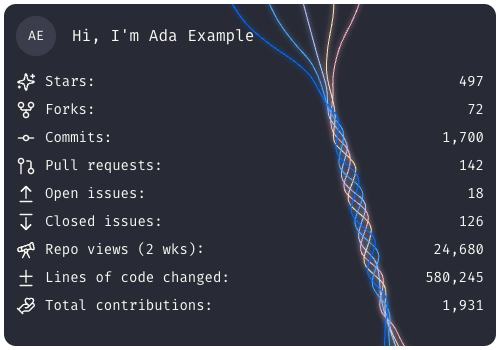
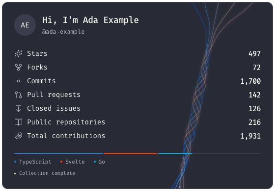
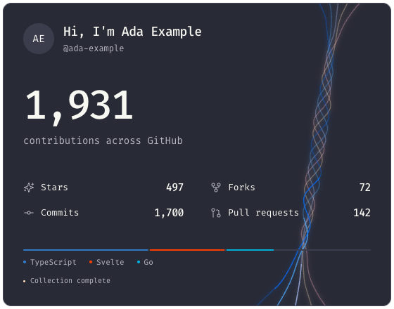
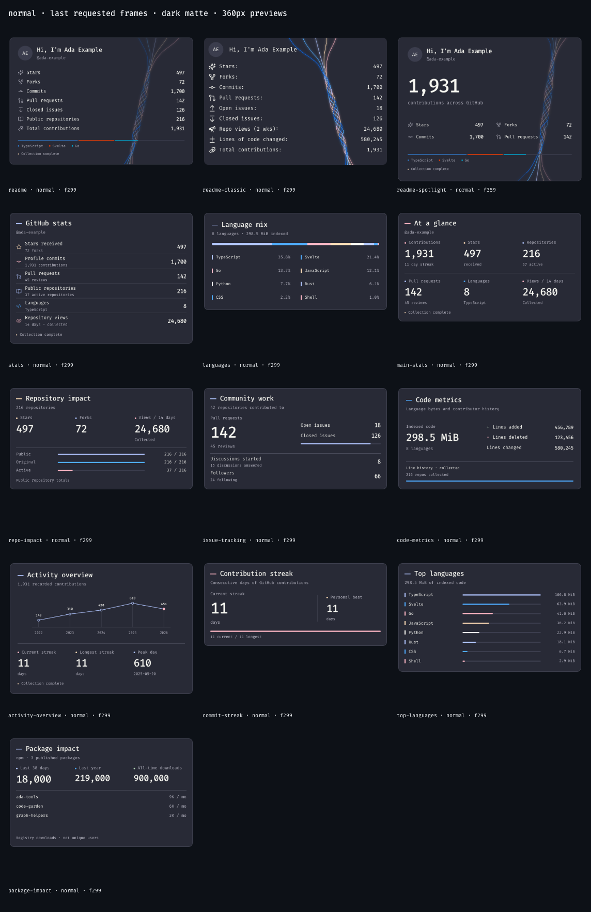

# Profile card previews

**Synthetic data · local initials · Fira Code · native-size previews**

Open [`index.html`](index.html) locally for GIF/WebP/poster selection, replay,
360px/native size controls, and dark/white mattes. The [design note](../design/original-profile.md)
records the recovered historical evidence and intentional refinements.

## Flagship cards

### Classic

500×350, 10 seconds, single-play. Nine unboxed rows, staggered fades, and fixed
values throughout the intro.



[Animated GIF](readme-classic.gif) · [Animated WebP](readme-classic.webp)

### Signature

560×390, 10 seconds, looping filaments with stable foreground text.



[Animated GIF](readme.gif) · [Animated WebP](readme.webp)

### Spotlight

560×440, 12 seconds, a contribution-led ambient loop.



[Animated GIF](readme-spotlight.gif) · [Animated WebP](readme-spotlight.webp)

## Full registry



[White-matte contact sheet](registry-light.png)

## Verification

**681 workspace tests**, build, typechecks, packed-consumer rendering, **234
rendered layout checks**, **18 profile key-frame checks**, and **26 decoded full
animations** passed. Lint completed with zero errors and six nonblocking warnings.
Both final review axes have no unresolved findings.

See the [verification record](verification.md) and [animation metadata/hashes](animation-report.json).
This committed gallery is approximately **2.7 MiB**, including both animation
formats, posters, the full-registry contact sheets, and its synthetic fixture.

| Card | GIF | WebP | Playback |
| --- | ---: | ---: | --- |
| Classic | 321.3 KiB | 333.3 KiB | Once |
| Signature | 227.0 KiB | 312.7 KiB | Infinite ambient loop |
| Spotlight | 301.4 KiB | 354.3 KiB | Infinite ambient loop |

GIFs were losslessly optimized with Gifsicle 1.96; every decoded pixel and its
display duration matched the original FFmpeg output. Consecutive identical
frames are coalesced without shortening playback.

## Fixture summary

The example identity is **Ada Example** (`ada-example`), with a fixed snapshot
timestamp of **2026-05-29T00:00:00.000Z**. These numbers are illustrative:

| Metric | Value |
| --- | ---: |
| Contributions / profile commits | 1,931 / 1,700 |
| Stars / forks received | 497 / 72 |
| Public repositories | 216 |
| Pull requests | 142 |
| Open / closed issues | 18 / 126 |
| Views over 14 days | 24,680 |
| Lines added + deleted | 456,789 + 123,456 |
| Languages | 8 |
| Package downloads over 30 days | 18,000 |

## Reproduce

From the repository root, after `pnpm install --frozen-lockfile` and `pnpm build`:

```sh
pnpm render --entry-point packages/remotion/src/app.tsx \
  --props docs/previews/input.json --cards readme-classic,readme,readme-spotlight \
  --formats png,webp,gif --scale 1 --out-dir artifacts/preview-reproduction

node packages/remotion/scripts/profile-graphics.mjs
```

Animations require FFmpeg with `libwebp` and Chrome/Chromium. Supply
`--ffmpeg-executable` / `--browser-executable` to use explicit installations.
The API and CLI default to 2×; `--scale 1` keeps this review gallery compact.
Full research, frame sequences, and exhaustive galleries are git-ignored.

For the compact GIFs used here, optimize each raw render into a separate file:

```sh
gifsicle -O3 --careful artifacts/preview-reproduction/readme.gif \
  -o artifacts/preview-reproduction/readme.optimized.gif
```
